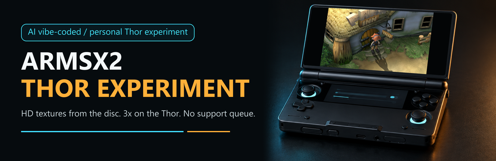
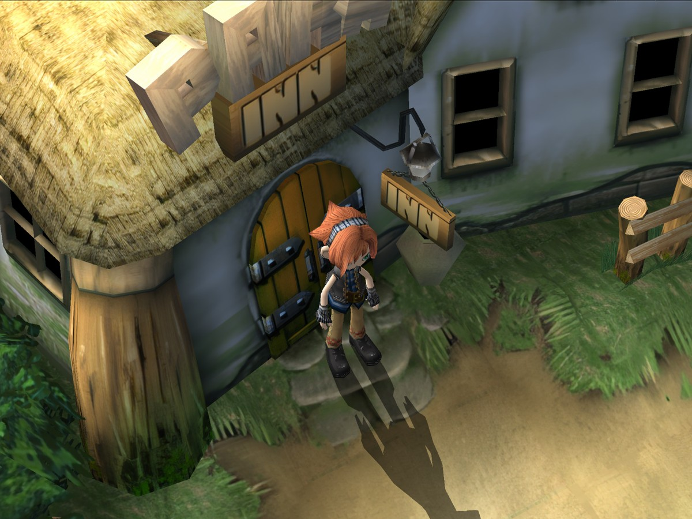
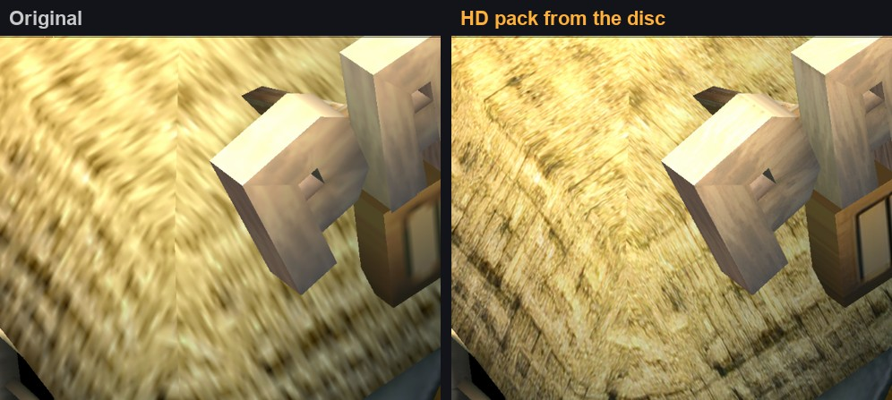
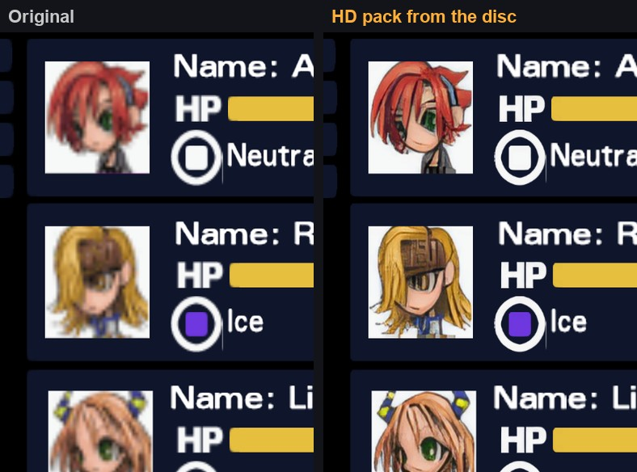
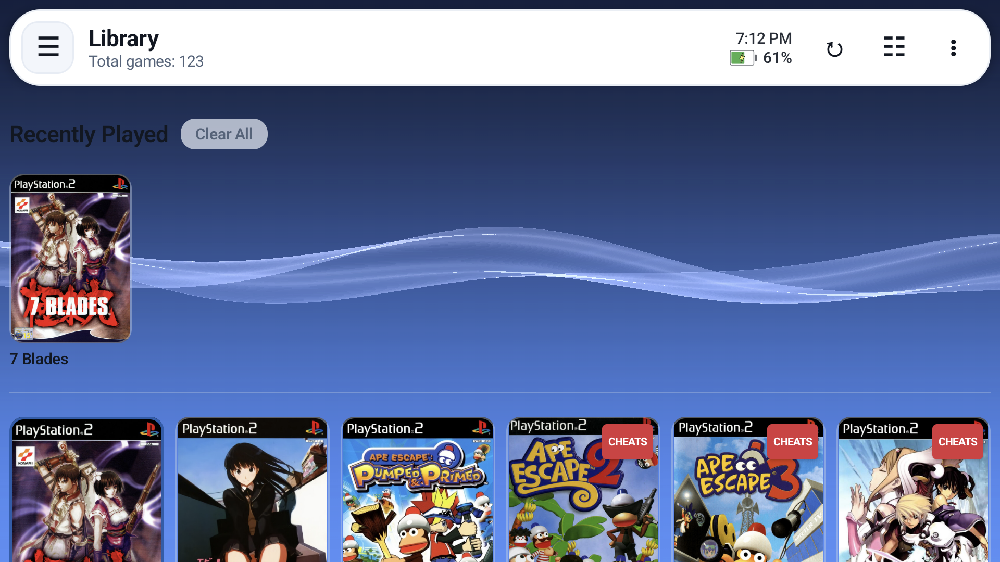
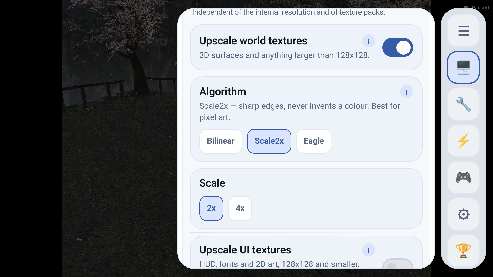

<div align="center">



# ARMSX2 Thor Experiment

Personal, unsupported AYN Thor experiment fork of ARMSX2.


</div>

This is a fork I am using to make ARMSX2 feel better on the AYN Thor. It is vibe-coded with AI, changed quickly, and intentionally opinionated. No stability guarantee, no support promise, no polish promise.

If that bothers you, look elsewhere. Fork it, break it, fix it, make it yours.

Please do not open issues expecting support or a roadmap. This is not a product queue. It is a personal experiment that happens to be public.

Bring your own legally dumped PS2 BIOS and games. Use this only for personal experimentation.

## **HD Textures Straight From The Game Disc**

**This fork builds HD texture packs from the game disc itself - no playing through the game to dump textures.** Every texture is read off the disc image, upscaled whole on a desktop GPU, and matched by the emulator to what the game draws, exactly. Okage: Shadow King got a complete 4x pack (2,807 textures) in under 15 minutes of GPU time, menus and portraits included.



| | |
| --- | --- |
|  |  |



**Two ways to get HD textures, and they work together:**

| | Standard packs (PCSX2 / ARMSX2) | **Disc packs (this fork)** |
| --- | --- | --- |
| Textures come from | Dumps made while someone plays | **The game disc, directly** |
| Coverage | What the player reached | **Every texture on the disc** |
| Making one | Play everything with dumping on | **Run three tools** |
| Works in stock PCSX2 | Yes | No, this fork |

A texture with its own standard file uses it; a disc pack covers the rest. **Want to make one for your game? Start with [docs/hd-texture-packs.md](docs/hd-texture-packs.md)** - the Okage tools are in `tools/disc_textures/`, and only the disc-format reader is per game.

## What This Fork Adds Over ARMSX2

The app is upstream [ARMSX2](https://github.com/ARMSX2/ARMSX2) — its Kotlin/Compose frontend and PCSX2-derived core — plus the changes below. Everything in this section is fork work; anything not listed behaves like upstream.

### Speed on the Thor

The Thor's Qualcomm Vulkan driver cannot read the frame it is drawing, so every draw that needs to read it ends the render pass, copies the whole frame and starts again. The fork's renderer work removes those reads where it can do the same job another way.

| | Before | Now |
| --- | --- | --- |
| Okage: Shadow King, 2x fast-forward | 45-49 fps | **119.9 fps** (Tenel and the World Library) |
| Render passes a frame in Okage's shadow scenes | 700+ | **9-12** |
| Okage's character shadow on the Thor | pale smear with jagged pieces | correct Shadow King silhouette, matches the software renderer |

- **Alpha-bit stencil tricks without frame reads** (Vulkan, devices without in-pass reads). Games that use bit 7 of the frame's alpha as a one-bit stencil (mark, destination-alpha test, clear) now get: logic ops for the mark and clear, a stencil copy of the test kept current inside the render pass, and the test draw's `Ad` blend fed a doubled alpha under the stencil instead of a software blend. Not Okage-specific. Code: `pcsx2/GS/Renderers/Common/GSAlphaBitLogicOp.h`.
- **Per-game GameDB fixes, on by default.** Okage drops auto-flush and skips its depth-of-field pass (144 -> 5 render passes a frame outdoors).
- The renderer changes were checked by replaying GS dumps on the Thor itself and comparing against the software renderer, not just against the previous build. Full write-up: [docs/games/okage.md](docs/games/okage.md).

### Texture upscaling in the emulator

- **Disc packs (above):** HD packs made from the game disc with no playing, matched exactly to what the game draws, menus and portraits included. Guide: [docs/hd-texture-packs.md](docs/hd-texture-packs.md).

Screen upscalers (FSR, shader chains) work on the finished frame. The fork also upscales **each texture as the game uploads it**, so the game renders from sharper art.

- **RAISR-HD**, on by default: learned kernels fitted on community HD texture packs, bundled in the APK. Gives any game a sharper, edge-aware 2x without a pack. Not a neural net: a few hundred operations per pixel on a worker thread. It beat Lanczos on every held-out pack it was tested on.
- Seventeen other filters (resample, pixel art, edge-directed, neural with your own model) plus a Deposterize pre-pass. World and UI textures have separate settings.
- You can switch filter and scale from the in-game menu. **Reload textures** (menu button or hotkey) re-runs what is on screen, so you can compare filters without leaving the game.
- Scaling runs off the render thread and is cached. An installed HD pack always wins over the upscaler.

### Cheats

- Bundled cheat files are copied in only when missing, so they never overwrite your edits. They come from the NetherSX2 patch collection plus GameHacking.org PCSX2 exports, cleaned of codes that would write garbage. Each cheat section is its own switch, and all start off.
- A `CHEATS` badge on a cover appears only when a real `.pnach` exists for that game. Widescreen and 60 FPS patches never count.
- New cheats are authored on desktop PCSX2 with the `ps2-cheat` skill and the `pcsx2` MCP server; the first result is Okage's no-encounter cheat. Existing ones are found with the `find-ps2-cheats` skill. See [docs/cheat-tooling.md](docs/cheat-tooling.md).

### Library, controls and defaults

- Cover-first game list with xlenore PS2 covers by default.
- An `HD` badge on covers: solid when a texture pack is installed, hollow when the online catalogue has one. Tap it to open Texture Packs for that game.
- **Multi-disc games are one card**, with an "N DISCS" badge, the other discs in the long-press menu, and "Insert Disc N" in the pause menu.
- **Sharp on the Thor's 1080p screen by default:** internal resolution 3x on Snapdragon 8 Gen 2 (the first multiple past 1080 lines), 2x on the 865 Thor, and texture packs on.
- Fast Forward (toggle) is on **Select + R1** by default.
- On-screen touch controls are off by default, because the Thor has physical controls.
- The pause menu has shortcuts for renderer changes, fast forward, save states, disc changes, imports and individual cheat toggles.

### Removed on purpose

- **No in-app updater.** Upstream's updater follows ARMSX2/ARMSX2 releases and would replace this fork with an official build. Sideload builds yourself.

### Tooling for working on it

- An **on-device MCP dev server** (github flavor only, off by default, localhost over `adb forward`). It can boot games, load states, read and write settings, take screenshots and read counters, so a script can drive the testing. See [docs/mcp-server.md](docs/mcp-server.md).
- A desktop PCSX2 lab with PINE memory tools (`tools/pcsx2_mcp/`). `pcsx2-gsrunner`, built from the Android tree, replays a GS dump on the Thor's own GPU for timing and image checks.

## Screenshots

Screenshots are from a personal AYN Thor test device.

| Game selector | Texture upscaling, in-game |
| --- | --- |
|  |  |

| Okage: Shadow King in HD, 3x resolution with a disc pack |
| --- |
|  |

## Hotkeys On The Thor

- **Fast Forward (toggle): Select + R1** (hold Select, press R1). Needs a build from 2026-09-22 or later. A binding you already set or cleared in the hotkey tab wins over the default; Reset to defaults brings it back.
- Every other system hotkey is unbound. Bind them in Settings -> Controller -> System hotkeys as one button or a two-button combo: Menu / Pause, Quick Save / Load State, Cycle Save Slot, Screenshot, Fast Forward (hold), Slow Down (toggle), Increase / Decrease Resolution, Cycle Perf Stats (OSD), Toggle Texture Dumping, Reload Textures, Gyro (hold).
- Fast forward is also on the Thor's second-screen panel, in the pause menu, and in the dev server (`POST /tool/hotkey {"name":"fast_forward"}`).

The desktop PCSX2 lab's keys are in [docs/cheat-tooling.md](docs/cheat-tooling.md#desktop-pcsx2-lab-keys).

## Docs

- **Performance:** [Okage game notes](docs/games/okage.md) (why it was slow and wrong on the Thor, and what fixed it) · [ARM64 optimization review](docs/arm64-optimization-review.md)
- **HD packs:** [HD texture packs - standard vs disc packs, making one, sharing](docs/hd-texture-packs.md)
- **Textures:** [Texture upscaling research](docs/texture-upscaling-research.md) · [Neural models](docs/neural-models.md) · [Third-party ports and licences](docs/third-party.md) · [RAISR kernel trainer](tools/raisr_train.py)
- **Cheats:** [Cheat tooling](docs/cheat-tooling.md) · [Games without cheats](docs/games-without-cheats.txt)
- **Tooling:** [On-device MCP server](docs/mcp-server.md)
- **Background:** [Texture pack getter](docs/texture-pack-getter.md). Written before upstream shipped its own catalogue and installer; kept for the reasoning.

## What This Is Not

- Not official ARMSX2.
- Not PCSX2.
- Not a general support fork.
- Not a compatibility promise.
- Not a place to request features.

## Build From Source

From the repo root on Windows:

```powershell
Set-Location platforms\android
.\gradlew.bat :app:assembleGithubDebug
```

For a quicker Kotlin/Compose check:

```powershell
Set-Location platforms\android
.\gradlew.bat :app:compileGithubDebugKotlin
```

## Credits

This fork stands on the work of:

- [ARMSX2](https://github.com/ARMSX2/ARMSX2)
- [PCSX2](https://github.com/PCSX2/pcsx2)
- [PCSX2_ARM64](https://github.com/pontos2024/PCSX2_ARM64)
- [xlenore/ps2-covers](https://github.com/xlenore/ps2-covers)
- [NetherSX2-patch](https://github.com/noeldvictor/NetherSX2-patch)
- [GameHacking.org](https://gamehacking.org) — the `SERIAL_00000000.pnach` files under `assets/cheats` are its PCSX2 exports of community codes (credited per code inside each file), fetched slowly with its own export and shipped switched off
- [sashkinbro/EmuCoreX-Textures](https://github.com/sashkinbro/EmuCoreX-Textures) — the texture pack catalogue ARMSX2 mirrors, which the `HD` badges read

Licensed under GPLv3. See [COPYING.GPLv3](COPYING.GPLv3).
