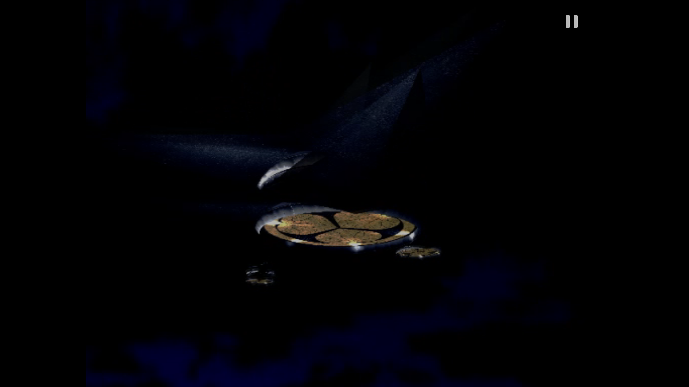

<div align="center">


# ARMSX2 Thor Experiment

Personal, unsupported AYN Thor experiment fork of ARMSX2.


</div>

This is a fork I am using to make ARMSX2 feel better on the AYN Thor. It is vibe-coded with AI, changed quickly, and intentionally opinionated. No stability guarantee, no support promise, no polish promise.

If that bothers you, look elsewhere. Fork it, break it, fix it, make it yours.

Please do not open issues expecting support or a roadmap. This is not a product queue. It is a personal experiment that happens to be public.

Bring your own legally dumped PS2 BIOS and games. Use this only for personal experimentation.

## Screenshots

Screenshots are from a personal AYN Thor test device.

| Game selector | Texture upscaling, in-game |
| --- | --- |
|  |  |

| Running, no touch overlay |
| --- |
|  |

## Where This Fork Diverges

- AYN Thor is the target device for layout, workflow, and sanity checks.
- The game selector favors cover-first browsing and hardcoded xlenore PS2 cover defaults.
- Cover cards show `CHEATS` only when real `.pnach` files exist in the selected ARMSX2 data root `cheats` folder.
- Cover cards also show an `HD` badge: solid when a texture pack is installed for that game, hollow when the online catalogue has one to download. Tapping it, or the long-press menu row, opens Texture Packs with that game selected. Installed means the pack folder exists, so hand-copied packs count too.
- Bundled real cheat PNACHs from the NetherSX2 patch collection are included under `platforms/android/app/src/main/assets/cheats` and copied only when missing.
- Cheat controls are split by PNACH section so each cheat section can be toggled on its own.
- Widescreen and 60 FPS patch metadata are intentionally not used for cheat badges or cheat switches.
- The Compose pause menu has Thor-friendly shortcuts for renderer changes, fast forward, game state, disc changes, imports, and individual cheat toggles.
- The refreshed upstream Kotlin/Compose frontend and PCSX2-derived native core are the active path.
- Texture upscaling runs per texture as the emulator uploads it, not on the finished frame, with separate settings for world and UI textures. Because the result is cached, a texture is scaled once rather than every frame.
- Seventeen filters grouped by how they decide — resample, pixel art, edge-directed, neural — plus a Deposterize pre-pass for the banding 16-bit PS2 textures leave in gradients.
- Scale and algorithm are changeable from the in-game menu, so filters can be compared without leaving the game.
- Scaling runs on a worker thread; the native texture is drawn immediately and the upscaled one swaps in when it is ready.
- A texture covered by an HD pack is never upscaled, even while the pack texture is still loading; the upscaler only fills in what the pack leaves native.
- **RAISR-HD**: learned upscaling kernels fit on the HD texture packs, bundled in the APK and on by default, so a game with no pack still gets a sharper, edge-aware 2x on the fly. Not a neural net; a few hundred operations per pixel on the existing worker thread. On held-out pack textures it beats Lanczos by +0.1 to +3.6 dB depending on the art. `tools/raisr_train.py` fits the kernels from any pack.
- A **Reload textures** button in the pause menu and a matching hotkey re-run every visible texture through the current filter, so switching filters mid-game is instantly visible.
- An on-device **MCP dev server** (github flavor only, off by default, localhost over `adb forward`) can boot games, read and write settings, save and load states, capture screenshots and read upscaler counters, so the filters can be compared by a script rather than by hand.
- **Multi-disc games are one card.** Discs are linked by the "[Disc N of M]" tag in the GameDB title (filename patterns as the fallback), never across regions. The card carries an "N DISCS" badge, the other discs are rows in its long-press menu, and the pause menu offers "Insert Disc N" for the running game without a file picker.
- **No in-app updater.** Upstream's checks ARMSX2/ARMSX2 releases and would replace this fork with an official build; the github flavor ships the same no-op stub as Play. Sideload builds yourself.
- The Fast Forward (toggle) hotkey defaults to Select + R1; everything else stays unbound until you bind it.
- **Per-game speed fixes in the fork's GameDB, on by default.** Okage: Shadow King drops auto-flush and skips its depth-of-field pass: 144 -> 5 render passes a frame outdoors, which is what made it stutter on a tiled mobile GPU. Details in [docs/games/okage.md](docs/games/okage.md).
- **Destination-alpha stencil tricks without frame reads (Vulkan, Thor's Qualcomm driver).** Some games use bit 7 of the frame's alpha as a one-bit stencil: mark, test with DATE, clear. The Thor's driver cannot read the frame in-pass, so every such draw was an end-pass + copy + restart. Now the mark and clear run as GPU logic ops, the test uses a stencil copy those draws keep current inside the render pass, and the test's `Ad` blend gets the target's alpha doubled under the stencil first instead of a software blend. Okage's character shadows went from ~700 render-pass breaks a frame to 9-12, and from a pale smear to the correct Shadow King silhouette (they were wrong on the Thor in every earlier build). In game, 2x fast-forward now holds 119.9 fps (was 45-49 with fast-forward on). Code in `GSAlphaBitLogicOp.h`; each step verified against the software renderer by replaying GS dumps on the Thor.
- On-screen touch controls default to off, and the top-right pause glyph goes with them. The Thor has physical sticks and buttons, so the overlay was covering the game to duplicate controls already under your thumbs. That corner stays tappable either way.

## Hotkeys

**On the Thor (ARMSX2).** Fast Forward (toggle) defaults to **Select + R1** (hold Select, press R1); it needs a build from 2026-09-22 or later, and a binding you already set or cleared in the hotkey tab wins over the default (Reset to defaults brings it back). Every other system hotkey is unbound by default. Bind them in Settings ->
Controller -> System hotkeys, as a single button or a two-button combo (hold the first,
press the second). The actions: Menu / Pause, Quick Save State, Quick Load State, Cycle
Save Slot, Screenshot, Fast Forward (hold), Fast Forward (toggle), Slow Down (toggle),
Increase / Decrease Resolution, Cycle Perf Stats (OSD), Toggle Texture Dumping, Reload
Textures, Gyro (hold). Fast forward is also on the Thor's second-screen panel, the pause
menu, the on-screen widget, and the dev server (`POST /tool/hotkey {"name":"fast_forward"}`;
also `quick_save`, `quick_load`, `reload_textures`, `texture_dump`).

**On the desktop PCSX2 cheat lab** (`tools/pcsx2_mcp/setup.py` writes this ini):

| Key | Action | | Key | PS2 pad |
| --- | --- | --- | --- | --- |
| Tab | Turbo (fast forward) toggle | | Arrows | D-pad |
| F8 | Screenshot to `snaps/` | | W A S D | Left stick |
| F9 | Single-frame GS dump to `snaps/` (replay it on the Thor with `pcsx2-gsrunner`) | | | |
| F1 / F3 | Save / load state slot | | T F G H | Right stick |
| F2 / Shift+F2 | Next / previous slot | | K L J I | Cross, Circle, Square, Triangle |
| Space | Pause | | Enter / Backspace | Start / Select |
| Esc | Pause menu | | Q E / 1 3 / 2 4 | L1 R1 / L2 R2 / L3 R3 |
| Alt+Enter | Fullscreen | | | |

## Exploration Notes

Notes on what I am poking at. The texture filters are built and running; most of the rest is not. No promises, no dates.

- [Texture upscaling on AYN Thor](docs/texture-upscaling-research.md) — upscaling each texture inside the emulator as you play, rather than upscaling the screen. Why that cost model works on a handheld and what would sink it.
- [Third-party ports](docs/third-party.md) — where the filters come from, their licences, and the two places I deliberately match a reference's quirk rather than "fixing" it.
- [Neural models](docs/neural-models.md) — the `.a2nn` format, why no weights ship, and a tool that proves the path works before you have any.
- [ARM64 optimization review](docs/arm64-optimization-review.md) — the Thor is four different CPU cores, and local debug builds were quietly testing different codegen than every release.
- [Cheat tooling](docs/cheat-tooling.md) — measured: 46% of the games on my card have no bundled cheats, and the public collections turn out to be the same set we already bundle. Closing that gap means authoring, not importing — which the `ps2-cheat` skill and the `pcsx2` MCP server (`tools/pcsx2_mcp/`) now do on desktop PCSX2. First result: Okage's no-encounter cheat, found and shipped in one session.
- [Games without cheats](docs/games-without-cheats.txt) — the missing list with what exists online for each: the serial-keyed GitHub DB, then gamehacking.org's PCSX2 export (`tools/cheat_finder/`, the `find-ps2-cheats` skill), fetched slowly and cleaned of un-decrypted codes.
- [RAISR kernel trainer](tools/raisr_train.py) — fits the RAISR-HD kernels from HD packs and reports PSNR/SSIM against Lanczos on held-out textures. Kernels are general, not per game.
- [Texture pack getter](docs/texture-pack-getter.md) — written before upstream shipped its own catalogue and one-tap installer, which this fork now inherits. Kept for the reasoning; the fork's part is the cover badge.
- [Game notes](docs/games/) — per-game measurements and fixes; [Okage](docs/games/okage.md) first: why it dropped frames (a depth-of-field read-back under auto-flush on desktop; on the Thor, 350 shadow strips a frame each forcing frame reads), how the renderer now draws the shadows without reads, why the shadow shape was wrong on the Thor, and the "HD pack in advance" idea. No released Okage HD pack exists yet.
- [On-device MCP server](docs/mcp-server.md) — now built: a localhost control surface over `adb forward`, so comparing twenty upscalers is a loop instead of an afternoon of menu-poking.

## What This Is Not

- Not official ARMSX2.
- Not PCSX2.
- Not a general support fork.
- Not a compatibility promise.
- Not a place to request features.

## Build From Source

From the repo root on Windows:

```powershell
Set-Location platforms\android
.\gradlew.bat :app:assembleGithubDebug
```

For a quicker Kotlin/Compose check:

```powershell
Set-Location platforms\android
.\gradlew.bat :app:compileGithubDebugKotlin
```

## Credits

This fork stands on the work of:

- [ARMSX2](https://github.com/ARMSX2/ARMSX2)
- [PCSX2](https://github.com/PCSX2/pcsx2)
- [PCSX2_ARM64](https://github.com/pontos2024/PCSX2_ARM64)
- [xlenore/ps2-covers](https://github.com/xlenore/ps2-covers)
- [NetherSX2-patch](https://github.com/noeldvictor/NetherSX2-patch)
- [GameHacking.org](https://gamehacking.org) — the `SERIAL_00000000.pnach` files under `assets/cheats` are its PCSX2 exports of community codes (credited per code inside each file), fetched slowly with its own export and shipped switched off
- [sashkinbro/EmuCoreX-Textures](https://github.com/sashkinbro/EmuCoreX-Textures) — the texture pack catalogue ARMSX2 mirrors, which the `HD` badges read

Licensed under GPLv3. See [COPYING.GPLv3](COPYING.GPLv3).
