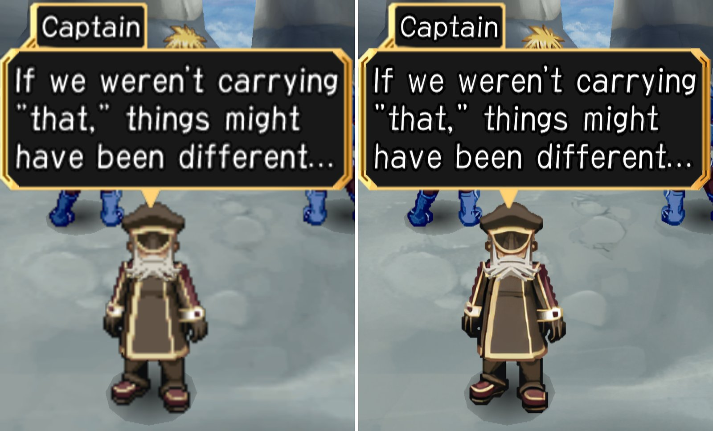

# Games with disc HD packs

Every game this fork can build a disc HD texture pack for, and every game looked at. Each name
links to that game's README: before/after screenshots, the one command, measured build times,
what the pack covers and what it doesn't, and notes on how the game stores its textures.

How to build a pack from a recipe, and how to add a game: [README.md](README.md). How disc packs
work: [docs/hd-texture-packs.md](../docs/hd-texture-packs.md). Disc packs only work in this fork.

Build times are for the upscale PC used so far: Core i7-11700, 32 GB RAM, RTX 3060 12 GB.

## Recipes

| | Game | Status | Pack | Build time | Coverage |
| --- | --- | --- | --- | --- | --- |
|  | [Okage: Shadow King](SCUS-97129-okage/README.md) SCUS-97129, NTSC-U | **Finished** | 334 MB zip 467 MB installed | ~16 min | All 2,800 disc textures: world, characters, menus, portraits, fonts, true-colour night art. Not yet seen on screen: the IQ24 font, one 32-bit texture. |
|  | [Tales of Destiny: Director's Cut](SLPS-25842-tales-of-destiny-dc/README.md) SLPS-25842, English patch v1.6 | **In progress** | 8.5 GB zip 14.8 GB installed | ~5 h 10 min (not a clean run) | Maps, map atlases, sprites, font, title screen: 4x pack runs on the Thor (ship 47/47, title 16/16, 59.9 fps at 3x). Towns, battles and menus not tested yet. |
| *screenshots once the 4x pack is judged* | [River King: A Wonderful Journey](SLUS-21275-river-king/README.md) SLUS-21275, NTSC-U | **In progress** | ~2 GB installed (estimate) | not measured yet | Every texture of the five opening scenes tested (title, menus, name entry, dialogue, the house), text included; fishing, river and town scenes not tested yet. |

**Status**: *Finished* - the pack is built, judged on the Thor at 3x across the game, and the
README has measured times and checksums. *In progress* - the pack works, but only part of the
game has been checked or the timings are not from a clean run.

## Wishlist

Games wanted next, not started. Nothing here yet.

| Game | Serial | Why | Known so far |
| --- | --- | --- | --- |

## Checked, not a candidate

Games whose textures turned out not to be buildable from the disc (textures made at runtime,
formats nobody could decode, 16-bit textures the tools do not handle yet), with the reason, so
nobody repeats the work. Nothing here yet.

| Game | Serial | Why not | Checked |
| --- | --- | --- | --- |

## Adding a row

A game gets a row here when its recipe folder exists (`hd-packs/<SERIAL>-<name>/`, README from
[TEMPLATE.md](TEMPLATE.md)). Put a before/after image from the game's `media/` in the first
column, the zip and installed sizes from `make_pack.py`'s output, and the total of its step
times. A game checked and dropped goes in the last table instead, with what was found.
