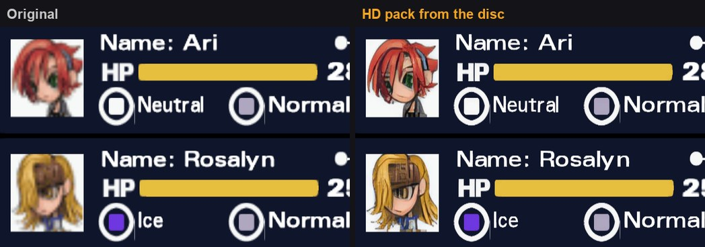
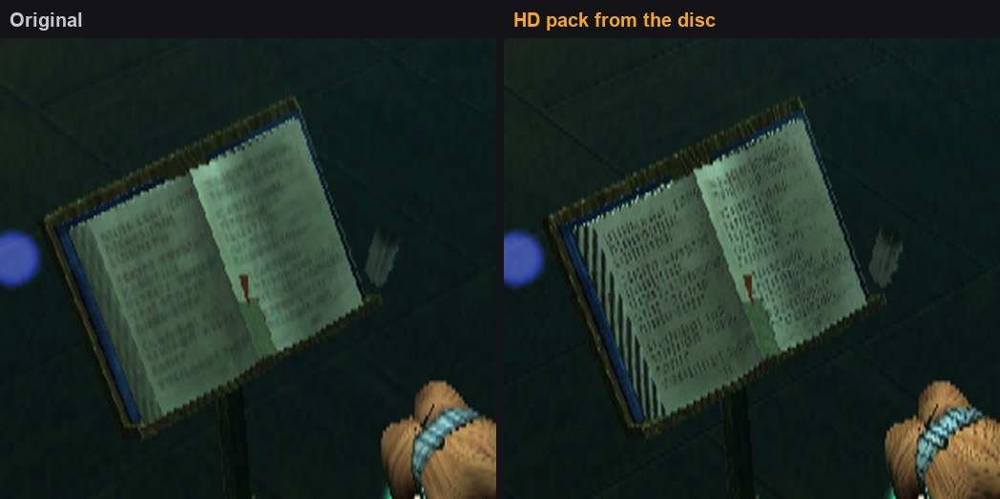
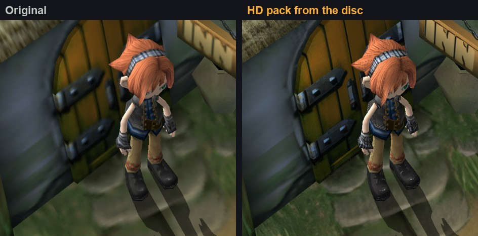

# Okage: Shadow King (SCUS-97129) - disc HD texture pack recipe

**Status:** finished. NTSC-U disc; every texture on it, at 4x.

A 4x HD pack for Okage: Shadow King (NTSC-U), built from your own disc. No gameplay dumping:
every texture is read off the disc, upscaled with 4x-UltraSharp and matched exactly by the
emulator. How that works: [docs/hd-texture-packs.md](../../docs/hd-texture-packs.md). Game notes:
[docs/games/okage.md](../../docs/games/okage.md).

## Before / after





| | |
| --- | --- |
|  |  |

Screenshots: the AYN Thor at 3x internal resolution (the status menu is a GS dump replayed on the
Thor with and without the pack).

## Make it

Requirements are in [hd-packs/README.md](../README.md#making-a-pack-from-a-recipe). From the
repository root:

```bash
python tools/disc_textures/make_pack.py hd-packs/SCUS-97129-okage \
    --disc "Okage Shadow King.chd" --model 4x-UltraSharp.safetensors
```

Or step by step (what `make_pack.py` runs, with `work/` as the work folder):

```bash
python tools/disc_textures/disc.py "Okage Shadow King.chd" work/                    # -> work/disc.iso
python tools/disc_textures/extract_native.py hd-packs/SCUS-97129-okage/extractor.py work/disc.iso work/native
python tools/disc_textures/upscale.py work/native work/hd4x --model 4x-UltraSharp.safetensors --scale 4
python tools/disc_textures/build_disc_pack.py hd-packs/SCUS-97129-okage/extractor.py work/disc.iso work/hd4x work/pack_hd4x/replacements
```

Install: unzip `work/SCUS-97129-disc-hd4x.zip` into `<DataRoot>/textures/` (or copy
`work/pack_hd4x/replacements` to `<DataRoot>/textures/SCUS-97129/replacements`).

### Measured on an RTX 3060 12 GB

A clean run from the `.chd`, 2026-09-22 (Core i7-11700, 32 GB RAM, RTX 3060 12 GB, CUDA fp16):

| Step | Time | Output |
| --- | --- | --- |
| disc (chdman + sector strip) | 23 s | `disc.iso`, 436 MB |
| extract | 15-28 s | `native/`: 2,810 PNGs, 39 MB (3 palette-free font sheets, 174 true-colour) |
| upscale 4x | about 12 min 45 s (3.7 textures/s) | `hd4x/`: 597 MB |
| build | 1.5-2 min | `pack_hd4x/replacements/`: 467 MB (2,797 ASTC images, 3 palette-free PNGs, a 38.1 MB index; 5 duplicate and 7 blank disc images left out) |
| zip | 15-40 s | `SCUS-97129-disc-hd4x.zip`, 334 MB |
| **total** | **about 16 min** | |

The upscale is the clean run's 727 s for the palette images plus 34 s for the 173 PSMCT24 and a
few seconds for the one PSMCT32 image, which were added afterwards and timed on their own. It was
measured before `upscale.py` batched small textures, so it is an upper bound. The build is the ASTC
pack (2026-09-23, 85 s including astcenc); `--format png` makes the lossless PNG pack instead,
632 MB and a 639 MB zip. Build and zip vary with the disk cache. Plan for about 2.5 GB of free
disk for the work folder, plus the disc image. `--scale 2` makes a 2x pack (the model still runs
at 4x and the result is downscaled, so the time is the same; the pack is about a quarter of the
size).

## Coverage

- **World and characters**: every palette texture in the game's `.XIM` images, loose or inside
  `.XPF` archives (2,633 images).
- **True-colour images** (173 PSMCT24 `.XIM` files): the night versions of town and field art,
  some outdoor maps and a village room, the World Library's books and bookshelves, and several
  characters' faces. Okage draws them with TEXA.AEM on, so black is transparent; the pack keeps
  that in the upscaled alpha. Plus the one PSMCT32 image, `svi_009a` in the starting village.
- **Menus and portraits**: the status menu sheet, character portraits, the 640x480 backgrounds.
- **Fonts**: `BM.FNT`, `BMUI.FNT` and the bold 24 px `IQ24.FNT`. The game colours these at
  runtime, so the pack stores an HD index map and the emulator paints it with the game's
  palette. The palette used for upscaling is the one the game uses (read from the emulator
  log), see `extractor.py`. BM and BMUI are verified on the status menu; IQ24 is in the pack
  but no screen that draws it has been checked yet.

Checked on the Thor with `gsrunner` replays of GS dumps at 3x, 2026-09-23 (a 1x pack against an
empty pack):

| Scene | Textures matched | 1x vs empty pack |
| --- | --- | --- |
| World Library | 64 (5 misses: one 1024x1024 texture under 4 palettes, and a 31x31 PSMT8H) | bit-identical |
| Tenel, outdoors | 35 of 35 | bit-identical |
| A house | 78 of 78 | bit-identical |
| Status menu | 12 (5 misses: the same 1024x1024 texture under 4 palettes, and a 1024x1024 PSMCT32 one) | bit-identical |

All 35 textures desktop PCSX2 dumped in one scene have their names reproduced from disc data.

## Not yet

- **Not seen on screen yet**: the IQ24 font and the PSMCT32 texture are in the pack and match
  exactly by construction, but no captured scene draws them.
- **A 1024x1024 texture** in the Library and menus misses under every palette it is drawn with;
  not investigated yet.
- **Small or soft art** (the 24-pixel field portraits) is where ESRGAN models invent detail;
  some of it looks painted rather than sharpened.
- **Neighbouring atlas pieces** can bleed a pixel into each other's edges, because whole
  atlases are upscaled in one go.

## How the disc stores its textures

Full details in [`extractor.py`](extractor.py)'s docstring. In short:

- `.XPF` archives (`XPFX` header, 32-byte entries) hold most files, each compressed with a
  bit-flag LZ (documented by simontime/xpftool; the extractor has its own implementation).
- `.XIM` images start with the GS `TEX0` value the game uploads with, so the PSM is right there.
  Palettes are stored in index order - **not** CSM1-swizzled, unlike most PS2 games - with PS2
  alpha, up to 0xFF in 16 palettes (kept raw through the upscale). True-colour images have no
  palette block, and some image blocks store the width where the block size should be.
- `.FNT` fonts are 256-wide 4-bit sheets with a per-character table; the game colours them with a
  palette it makes at runtime, so they are palette-free images painted at load time. Their
  4-byte header was the difference between a crop that matched 8 px off and the right one.
- What decided it: the XIM header's `TEX0` word made the format obvious, and 35 of 35 dumped
  texture names computed straight from disc data proved the game a candidate.

## Checksums

| | |
| --- | --- |
| Disc ISO SHA-1 (after `disc.py`) | `e25313668c682df863f0dde7c21bef0a3d8b79fa` |
| Upscale model SHA-256 (`4x-UltraSharp.safetensors`) | `36a340b5509b699d2c06cb445ddc1d3d39199ac734d889ed6d7915f60e05bcbc` |
| Index `disc-atlas.a2at` SHA-256 (ASTC pack) | `b8def8a4c5636944b697b617184e37da686efd67120a73244c925eecb29a14b4` |
| Index SHA-256 with `--format png` | `6d58e7f6fc4e0aeea2b2c6523148368530e4206111e134aabe506076dfa4369f` |

`make_pack.py` checks all three. The index is determined by the disc and `extractor.py`; the HD
images can differ slightly between GPUs.

## Playing with it

What the pack was tuned for on the Thor (8 Gen 2): 3x internal resolution, the RAISR-HD upscaler
left on (it covers whatever the pack doesn't), and 2x fast-forward on Select + R1. Measured with
the pack at 3x: Tenel 119.9 fps at 2x fast-forward (GPU 63%), the World Library ~108 fps.
