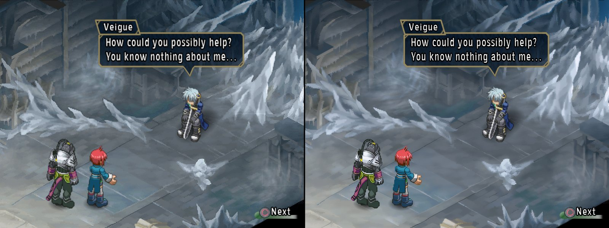
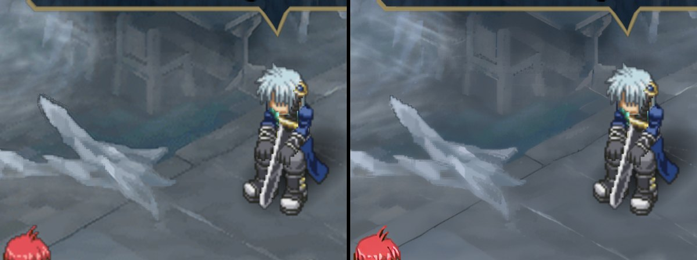
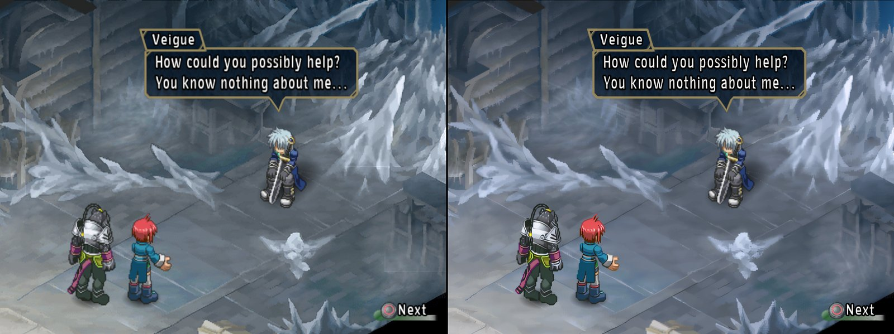

# Tales of Rebirth (SLPS-25450) - disc HD texture pack recipe

**Status:** completed. Japanese disc with the English fan translation v1.0 (the translation keeps
the serial). The 4x pack runs on the Thor at 3x in four scenes (title, the attract-mode battle, two
field scenes) at 59.9 fps; it is 12 GB installed, so it was removed from the Thor after the test.
The rest of the game is not checked.

A 4x HD pack for Tales of Rebirth, built from your own disc. No gameplay dumping: every texture is
read off the disc, upscaled with 4x-UltraSharp and matched exactly by the emulator. How that
works: [docs/hd-texture-packs.md](../../docs/hd-texture-packs.md).

## Before / after

The AYN Thor at 3x internal resolution, the app's own screenshots (1440x1080), original on the
left, HD pack on the right.







The floors, walls and cracks are the big change. Sprites change little (they were small pixel art
to begin with). The translucent ice pieces come out with harder, stepped edges than the original -
see *Not yet*.

## Make it

Requirements: [hd-packs/README.md](../README.md#making-a-pack-from-a-recipe). From the repository
root:

```bash
python tools/disc_textures/make_pack.py hd-packs/SLPS-25450-tales-of-rebirth \
    --disc "Tales of Rebirth (English v1.0).chd" --model 4x-UltraSharp.safetensors
```

The pack is ASTC, compressed with zstd (`.astc.zst`). Alpha was the hard part: the fields
alpha-test `GEQUAL 0x80`, and ASTC rarely stores 0x80 exactly, so the first ASTC build kept 65% of
the images as PNG - and the emulator gives up on a composite that mixes ASTC and PNG, which left
the fields native. `astc.py` now re-encodes the few failing blocks by hand so alpha stays on the
right side of 0x80 (`game.json` `"astc_alpha": "threshold"`; 8 M of 1.4 billion blocks), and
every image is ASTC. zstd halves the ASTC on disk (21.6 -> 10.7 GB). Against the earlier all-PNG
build (24.8 GB): half the size, textures load in 2-3 s instead of 16-18 s in the replays, a quarter
of the video memory, and frames within 43-48 dB of it.

Read the size estimate `make_pack.py` prints after the extract step before letting it upscale.

Install: unzip `work/SLPS-25450-disc-hd4x.zip` into `<DataRoot>/textures/` - on the PC. The pack
has 154,598 images, and Android's `unzip` stops at 65,534 entries, so copy the unpacked folder (or
stream a tar: `adb exec-in sh -c 'cd <folder> && tar -xf -'`, about 15 min into `/data/local/tmp`
and about 45 min into `/sdcard` over USB - Android's storage layer takes each small file slowly)
rather than unzipping on the device.

### Measured

`make_pack.py` into a fresh work folder from the ISO, 2026-09-24, Core i7-11700, 32 GB RAM,
RTX 3060 12 GB, nothing else heavy running. The build and zip steps were rerun from the same
upscaled images when the ASTC repair and zstd landed (2026-09-25); those are the times below:

| Step | Time | Output |
| --- | --- | --- |
| extract | 6.5 min | `native/`: 168,219 PNGs, 0.9 GB, 1,454 M texels (map sheets split per palette) |
| upscale 4x | 7 h 41 min | `hd4x/`: 25.3 GB |
| build | 119 min | `pack_hd4x/replacements/`: 12.0 GB - 154,499 ASTC images (zstd), 99 font index maps (PNG), a 1.3 GB index; 8.0 M blocks repaired; 13,082 duplicates and 539 blank images left out |
| zip | 15 min | `SLPS-25450-disc-hd4x.zip`, 11.1 GB |
| **total** | **about 10 h** | |

Free disk needed for the work folder: about 50 GB, plus the 4.5 GB disc image.

In the app on the Thor (8 Gen 2), 3x internal resolution, the first field: 59.9 fps (EE 38%,
GS 11%, GPU 13%).

Why so many images: Rebirth is a 2D sprite game. 37,689 small pictures (animation frames, icons)
come with 2-9 palettes each (colour-swapped enemies and variants) - 110,000 files but only 11% of
the upscale. The time is the map sheets: 375 sheets with about 3 palettes each, 908 M texels (62%)
even split per palette.

### Size

What the extractor yields, in native texels (one image per palette - an exact match needs the HD
image painted with the palette the game draws with), and what a 4x ASTC pack of it would take at
16 bytes per native texel:

| | Images | Native texels | 4x pack |
| --- | --- | --- | --- |
| Map sheets (1024x1024, 8-bit) | 604 | 2,125 M | 34.0 GB |
| Sprite frames and small UI | 44,071 | 252 M | 4.0 GB |
| 256-511 px images | 507 | 60 M | 1.0 GB |
| Font glyphs | 99 | 0.1 M | - |
| **Total** | 45,281 | 2,437 M | **~39 GB** |

The map sheets are the problem: 634 M texels of unique art, but each carries 3.4 palettes on
average, and the palettes are not lighting variants of one another (correlation 0.6-0.9 with large
per-entry differences, 2% true variants): different parts of one sheet are drawn with different
palettes. The field in the first scene uses three palettes of one sheet at once. So each palette's
HD image is mostly art that palette never draws, but there is no way to know which part from the
disc alone. Tried and dropped: one HD index map per sheet (upscale once, map back to indices, paint
with any palette) - 40 dB against a real upscale where it works, but a block given the wrong
palette turns into a garbage square, and the palettes are not variants enough to make that safe.

**Sparse sheets (in the extractor now).** The fields are tile maps: each map cell draws a 32x32 cell
of a sheet with one palette (the map sits next to the sheet in the same file, a `MAP` chunk after
the TIM2 and a `PANI` chunk; not decoded yet). In the first field one palette draws 18% of its sheet,
another 3%, the third 0.3%. Art looks smooth under the palette it is drawn with and like noise under
an unrelated one, so per tile a palette is kept where the art is within 1.5x of its smoothest look,
and each palette's tiles become rectangles, each its own image. A drawn sheet is then matched as a
composite of those rectangles; a tile guessed wrong stays native. Checked against the cells the
first field really draws (from its GS dump), and in `gsrunner` on the Thor:

| Tile, cutoff | Field cells kept | 4x pack (before duplicates) |
| --- | --- | --- |
| 64 px, 1.5 (the extractor's setting) | 222 of 226 (98.2%) | ~23 GB |
| 64 px, 1.25 | 96.9% | ~19.5 GB |
| 32 px, 1.5 | 98.2% | ~21 GB |
| 32 px, 1.25 | 96.5% | ~18.4 GB |
| 32 px, 1.1 | 93.8% | ~16 GB |

With the 64 px setting the 1x pack is still bit-identical to an empty pack in all four scenes, and
the field sheet matches as a composite of 15 and 29 pieces. 32 px tiles make up to 119 pieces per
palette (the composite matcher checks 256 placements) and are not tested on the Thor yet. Decoding
the `MAP` chunks would give each palette's cells exactly (about 16 GB, no guessing).

## Coverage

A 1x pack against an empty pack, `gsrunner` replays of desktop GS dumps on the Thor at 3x,
2026-09-24: every frame bit-identical in all four scenes, so every match is exact. The 4x pack in
the same replays (and in the app for the first field: 55 matched, 4 missed):

| Scene | Matched | Misses |
| --- | --- | --- |
| Title | 41 (35 font glyphs, 1 true-colour) | 1 glyph |
| Attract-mode battle | 31 (27 sprite composites) | 70 - its 256x1024 UI sheet under palettes made at runtime |
| First field | 54 (26 glyphs, 17 composites - the map sheet among them) | 4 sprites |
| Field after the first battle | 60 (26 glyphs, 22 composites) | 3 sprites |

Every composite loads (none with `Failed to cut` in the log). Sprites are drawn as composites -
several frames placed in one buffer - and match at 55-99% of their drawn texels (the rest stays
native); the map sheets match at 76-81% of the sheet's texels, the parts each palette draws.

Against the desktop texture dumps (same scenes plus the first real battle), before the anp3 fixes:
in normal play 3,044 sprite regions have their palette on the disc and 639 do not. The title demo
adds ~6,300 dumps with faded palettes made at runtime; the battle's 70 misses are mostly its
256x1024 UI sheet under such palettes.

## Not yet

- Only four scenes are checked; towns, dungeons and menus are not.
- Translucent ice and fog pieces in the fields get harder, stepped edges than the original. The
  upscale keeps alpha exact for the `GEQUAL 0x80` tests, and soft-edged art suffers from it; not
  investigated yet.
- Palettes the game makes at runtime (fades, hit flashes, the battle UI sheet) never match; those
  draws stay native. The title demo alone has ~6,300 such textures.
- The map sheets are split per palette by a guess (smoothness per 64x64 tile): in the first field
  222 of the 226 cells the game draws are kept, the other 4 stay native. Decoding the `MAP` chunks
  would make it exact.
- `FLD.BIN` (nine files, 0.8 GB) was looked at and holds geometry (float vertex data), no
  textures; every texture seen so far comes from `DAT.BIN` or the executable.

## How the disc stores its textures

Full details in [`extractor.py`](extractor.py)'s docstring. In short:

- `DAT.BIN`, `MOV.BIN` and `FLD.BIN`, indexed by tables inside the executable (DAT.BIN's at
  0xD76B0 in the English v1.0 `SLPS_254.50`), in Tales of Destiny's DAT.TBL entry format. Files are
  Tales-compressed (versions 1 and 3) or raw; packs (`SCPK`, plain offset tables) nest more of them.
- Map sheets are TIM2, 1024x1024 8-bit with several palettes; some palettes are flat silhouettes
  (shadows), which are dropped.
- Sprites are `anp3` files, as in Tales of Destiny (`tools/disc_textures/tales.py`): 4-bit frames
  behind 16-byte records, uploaded one frame at a time into a 256- or 512-wide buffer and drawn as
  composites. The bigger files run their frames past the header's CLUT offset to a 128/256-byte
  CLUT at the very end; reading the header's offset as the CLUT made up to 2,050 junk palettes per
  frame.
- The font is 24x24 4-bit glyphs in the executable just before DAT.BIN's table (English letters,
  digits, punctuation), coloured with a palette that stays resident in VRAM: palette-free images.

## Checksums

| | |
| --- | --- |
| Disc ISO SHA-1 (after `disc.py`) | `75d36646266334e7091268e24fe2fc4abd4a3331` |
| Upscale model SHA-256 (`4x-UltraSharp.safetensors`) | `36a340b5509b699d2c06cb445ddc1d3d39199ac734d889ed6d7915f60e05bcbc` |
| Index `disc-atlas.a2at` SHA-256 (ASTC + zstd pack) | `a8c3cb989887b008359a578a9d9af78667932e853dbd3b860ab28470848aac80` |

## Playing with it

GameDB: the fork's entry sets `disableSafeFeatures` and `forceEvenSpritePosition` for this serial
(the English patch's recommended settings).
