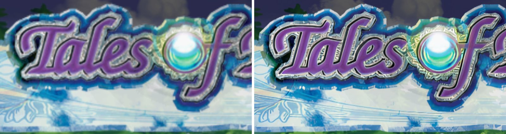
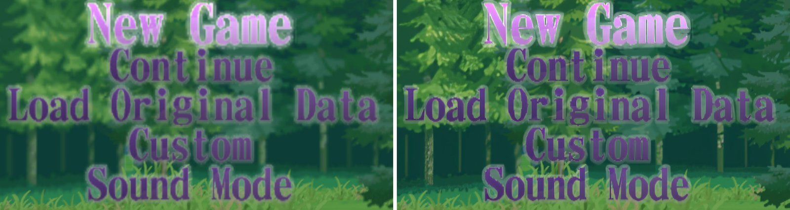

# Tales of Destiny: Director's Cut (SLPS-25842) - disc HD texture pack recipe

**Status:** completed. The English fan-translated disc (v1.6). The 4x pack is built and runs
on the Thor; it was checked in two scenes (the ship's deck and the title screen), not in the rest
of the game.

A 4x HD pack for Tales of Destiny: Director's Cut, built from your own disc. No gameplay dumping:
every texture is read off the disc, upscaled with 4x-UltraSharp and matched exactly by the
emulator. How that works: [docs/hd-texture-packs.md](../../docs/hd-texture-packs.md).

## Before / after






Screenshots: `gsrunner` replays of GS dumps on the AYN Thor at 3x internal resolution, 1:1 crops,
original on the left. 4x-UltraSharp adds some grain to the logo's silver rim.

## Make it

Requirements: [hd-packs/README.md](../README.md#making-a-pack-from-a-recipe). From the repository
root:

```bash
python tools/disc_textures/make_pack.py hd-packs/SLPS-25842-tales-of-destiny-dc \
    --disc "Tales of Destiny DC.chd" --model 4x-UltraSharp.safetensors
```

Install: unzip `work/SLPS-25842-disc-hd4x.zip` into `<DataRoot>/textures/`.

### Measured (not a clean run)

On the Core i7-11700 / 32 GB / RTX 3060 12 GB, 2026-09-23. The upscale ran in two parts (the map
atlases were found after the first) and Android builds shared the PC part of the time, so read
these as upper bounds:

| Step | Time | Output |
| --- | --- | --- |
| extract | 2 min 9 s | `native/`: 101,328 PNGs, 862 M texels |
| upscale 4x | 2 h 15 min for 99,606 images (small textures batched, ~11 a second) + 2 h for the other 1,810, mostly the 328 1024x1024 map atlases at ~18 s each | `hd4x/` |
| build | 52 min | `pack_hd4x/replacements/`: 8.0 GB - 97,844 images (95,831 ASTC with zstd, none kept as PNG, 2,013 palette-free font maps), a 1,066 MB index; 3,384 duplicate and 54 blank disc images left out (rebuilt 2026-09-25: ASTC with repaired alpha blocks, zstd) |
| zip | 7 min | `SLPS-25842-disc-hd4x.zip`, 7.3 GB |
| **total** | **about 5 h 15 min** | |

It is a big pack because the game has a lot of art: 328 field and town map atlases of 1024x1024
are 5.5 GB of it, 256x256 and 512x512 textures another 3.8 GB; the duplicates and blanks the build
leaves out were 0.2 GB. Free disk for the work folder: about 31 GB (HD PNGs 14.8 GB, the pack 8.0 GB, the zip 7.3 GB),
plus the disc image.

## Coverage

`gsrunner` replays of desktop GS dumps on the Thor at 3x, 2026-09-23. The 1x pack (every disc
image at native size, with `hw_mipmap=false`: the deck floor is mipmapped) against an empty pack
proves the matches exact; the 4x pack is the one you install:

| Scene | Textures matched | 1x vs empty pack | 4x pack |
| --- | --- | --- | --- |
| Ship's deck | 47 of 47 | bit-identical | 47 matched, no load errors, every frame changed |
| Title screen | 16 of 16 disc textures (the 17th lookup is the game's own frame buffer - the previous frame drawn back as one full-screen sprite, a fade - not disc art) | bit-identical | 16 matched, no load errors, every frame changed |

In the app (the save state from the same scene, 3x, RAISR-HD on): every texture of the ship's
deck matched, and the boot's three 640x480 logo screens too. The intro movie's frames count as
misses (2,700+ of them) - they are video, not disc textures.

What that covers: map textures and the field/town map atlases, character sprites (single frames
and the batches the game assembles in VRAM), the font (2,013 glyphs from the executable), the
title art (true colour) and the title menu text.

## Not yet

- **Only two scenes are proven.** Towns, battles, menus and cut-ins have not been dumped or
  played yet. That is what stands between this recipe and "finished".
- **No clean timings**: the build shared the PC with Android builds and ran in two parts.
- **Size**: 8.0 GB installed, 7.3 GB zipped (ASTC with zstd; it was 14.8 GB as plain ASTC). The index alone is 1.1 GB; the emulator memory-maps it (about
  40 MB resident on the Thor), but it is still download and disk.
- The first 4x pack (3.1 GB, PNG, before most of the fixes below) had wrongly coloured UI corners
  because the palette slicing changed between its extract and build steps.

## How the disc stores its textures

Full details in [`extractor.py`](extractor.py)'s docstring. In short:

- Everything but the movies is in `DAT.BIN`, indexed by `DAT.TBL`. Files are Namco's Tales
  compression (an LZSS; the window start differs by version, and getting it one byte wrong still
  decodes to the right size) or raw, and decoded files hold more compressed sub-files at any
  offset (`disc_codecs.find_tales_blobs`).
- Textures are TIM2 files written by Namco's own tool, which leaves the picture count, header
  size, CLUT size - and in 12,868 pictures both width and height - at 0. `tim2.py` is lenient
  about all of it; until it took the power-of-two square for a picture with no size, the game's
  whole field art (the 1024x1024 map atlases) was missing and nothing said so.
- 4-bit pictures with several palettes use 8x2 patches of a 16-wide CLUT, even small ones: the
  title text's 48-colour CLUT is drawn as entries 0-7 + 16-23 and 8-15 + 24-31.
- Character sprites are `anp3` files: frames back to back before one CLUT, every palette of it
  bound (one HD image per palette).
- The font is in the executable: 24x24 4-bit glyphs the game colours with a palette it makes at
  runtime, read out of a GS dump's VRAM.
- The game assembles textures in VRAM - sprite batches, text lines, and a party sprite page whose
  UV box also spans unrelated data - and parks a few bytes inside one deck map. The emulator's
  composites cover all of these; nothing game-specific was needed.
- Dead end worth knowing: the title's 32-bit uploads looked like 8-bit data in disguise; the
  upload/draw timeline (`gsdump.py --timeline`) showed they are plain true-colour pictures.

## Checksums

| | |
| --- | --- |
| Disc ISO SHA-1 (after `disc.py`) | `de934800cd81835a5f5335a0eab58299a16371eb` |
| Upscale model SHA-256 (`4x-UltraSharp.safetensors`) | `36a340b5509b699d2c06cb445ddc1d3d39199ac734d889ed6d7915f60e05bcbc` |
| Index `disc-atlas.a2at` SHA-256 (ASTC + zstd pack) | `b9e0f11fedbce799e2cb8370e8b53193e25245487a57266f8ad1b30a791ba144` |

## Playing with it

On the Thor (8 Gen 2) at 3x internal resolution with RAISR-HD left on, the ship's deck with the
pack runs at 59.9 fps with the GS thread at 11% and the GPU at 11% (the emulator's 30-second
PerfLog), so 2x fast-forward has room. The pack's 1.1 GB index is memory-mapped; loading it at
boot takes a moment.
