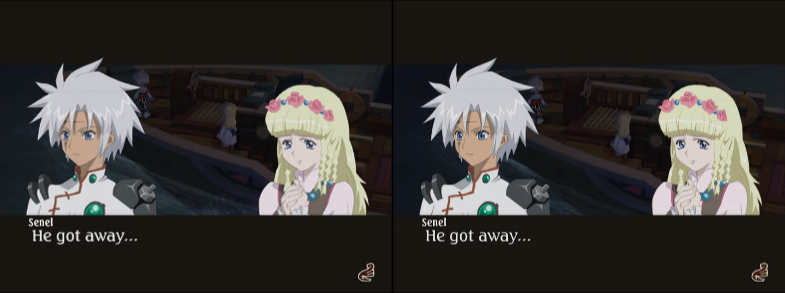
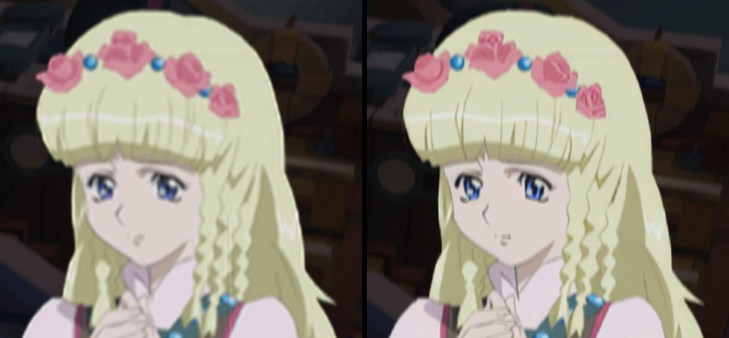
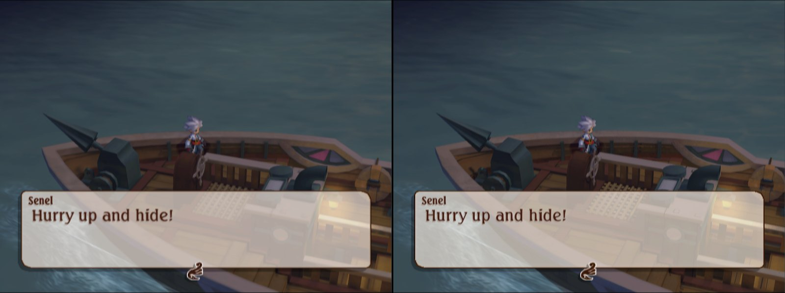

# Tales of Legendia (SLUS-21201) - disc HD texture pack recipe

**Status:** in progress. NTSC-U disc (the ReUndub v1.4 build - undubbing changes audio, not
textures). The 4x pack runs on the Thor at 3x in four scenes (title, main menu, the boat, a portrait
conversation) with every texture matched except render-target reads and two small UI pieces; the
rest of the game is not checked yet.

A 4x HD pack for Tales of Legendia, built from your own disc. No gameplay dumping: every texture
is read off the disc, upscaled with 4x-UltraSharp and matched exactly by the emulator. How that
works: [docs/hd-texture-packs.md](../../docs/hd-texture-packs.md).

## Before / after

The AYN Thor at 3x internal resolution, the app's own screenshots (1440x1080), original on the
left, HD pack on the right.







## Make it

Requirements: [hd-packs/README.md](../README.md#making-a-pack-from-a-recipe). From the repository
root:

```bash
python tools/disc_textures/make_pack.py hd-packs/SLUS-21201-tales-of-legendia \
    --disc "Tales of Legendia (USA).chd" --model 4x-UltraSharp.safetensors
```

Install: unzip `work/SLUS-21201-disc-hd4x.zip` into `<DataRoot>/textures/`.

### Measured

Not a clean run: the pack was built once, then rebuilt from the extract step when the font and the
title pictures were added, with other work on the PC both times. Core i7-11700, 32 GB RAM,
RTX 3060 12 GB, 2026-09-24:

| Step | Time | Output |
| --- | --- | --- |
| extract | 8.5 min | `native/`: 21,240 images, 601 M texels (199 font glyphs, 365 true-colour) |
| upscale 4x | about 2 h 5 min (first build; the rebuild only did the new images) | `hd4x/`: 12 GB |
| build | 29 min | `pack_hd4x/replacements/`: 11 GB - 20,132 images (14,274 ASTC, 5,662 kept as PNG because ASTC could not keep their alpha exact, 196 font index maps), an 810 MB index |
| zip | 7.5 min | `SLUS-21201-disc-hd4x.zip`, 7.79 GB |
| **total** | **about 2 h 50 min** | |

Free disk needed for the work folder: about 32 GB, plus the 3.8 GB disc image.

In the app on the Thor (8 Gen 2), 3x internal resolution, the portrait conversation: 59.9 fps
(EE 36%, GS 34%, GPU 21%).

## Coverage

A 1x pack against an empty pack, `gsrunner` replays of desktop GS dumps on the Thor at 3x,
2026-09-24: every frame bit-identical in all four scenes, so every match is exact. The 4x pack in
the same replays, and in the app:

| Scene | Matched | Misses |
| --- | --- | --- |
| Title | 10 (the 8 logo pictures, 32-bit) | 1 render-target read |
| Main menu | 47 (40 font glyphs) | a 1024x512 render-target read, one 32x16 UI piece |
| The boat | 36 (14 glyphs) | two render-target reads, one 64x32 UI piece |
| Portrait conversation | 37 (12 glyphs); in the app 71 matched, 5 missed | two render-target reads, the same 64x32 piece |

Against the textures desktop PCSX2 dumped in those scenes: every 8-bit texture (maps, models, the
skit portraits), all 67 font glyphs and all 8 title pictures reproduce from disc data.

## Not yet

- Only four scenes are checked. Towns, battles and menus beyond the main menu are not.
- Four small 4-bit UI textures (32x16 to 256x128): three have palettes that are not on the disc
  (made at runtime), one has its palette on the disc but no image matched.
- The 1024x512 and 1024x256 32-bit textures that miss are fully transparent render-target reads,
  nothing to replace.
- 96 extra true-colour readings (see below): 8 are the title pictures, the rest candidates; the
  ones that are not real never match and cost a little pack space.

## How the disc stores its textures

Full details in [`extractor.py`](extractor.py)'s docstring. In short:

- CRI AFS archives (`/AFS/*.AFS`); every entry a `CPS` file - a 16-byte header and Namco's Tales
  compression, version 1. The ISO's UDF bridge is stale after patching, so the disc is read with
  `isofs.py` (ISO 9660 only).
- The unpacked files hold no images: they hold the GS packets that upload them. Each texture
  goes up as PSMCT32 data into one streaming slot (block 0x3A80, its CLUT at 0x3A70) and is drawn
  from it as PSMT8/PSMT4. `gifscan.py` finds the uploads and TEX0 writes in any file and reads each
  texture back through the GS swizzle the way the draw does.
- Things that cost time: a 16x16 PSMCT32 upload drawn as PSMT8 is a 32x32 texture, not 64x16 (the
  block layouts differ - the size comes from marking the memory and reading it back); models
  upload the CLUT before the image, portraits after it, so both candidates are kept and the exact
  match picks; skit files set TEX0 before the upload, and one upload holds two 256x256 portrait
  frames, each a crop of the whole sheet.
- File order is not the order the GS runs the packets in (display lists call them). The title file
  sets up its eight 32-bit draws first and uploads the pictures after, so an upload that the file
  also draws as exactly itself (32-bit, same slot, width and size, PS2-range alpha) is read as a
  true-colour picture as well. Replacing the usual pairing instead broke 2,373 model textures.
- The dialogue font is a chain of 199 glyph records in `system_regident.mcd` (two faces, 24 or 32
  pixels wide). The game clears a corner of a 64x64 4-bit texture, uploads one glyph at (4,1) and
  draws it with a white alpha-ramp palette it uploads every frame, so glyphs are palette-free
  images. Rows are stored rounded up to even; the upload sends them rounded up to four and the GS
  keeps the even height.

## Checksums

| | |
| --- | --- |
| Disc ISO SHA-1 (after `disc.py`) | `9279255de74f48686c7c5084fb7b3a580d67d688` |
| Upscale model SHA-256 (`4x-UltraSharp.safetensors`) | `36a340b5509b699d2c06cb445ddc1d3d39199ac734d889ed6d7915f60e05bcbc` |
| Index `disc-atlas.a2at` SHA-256 (ASTC pack) | `bbb2bf6f5f5335b18777b444058964a6452431c1d37e0bea966b0b7906b384c4` |

`make_pack.py` checks them against `game.json`. The index depends only on the disc and
`extractor.py`; HD images can differ in the last bit between GPUs.
