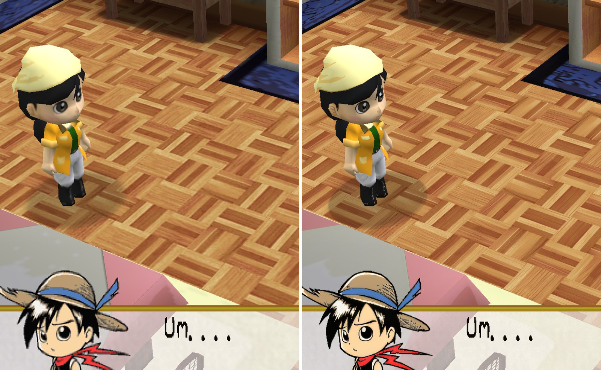
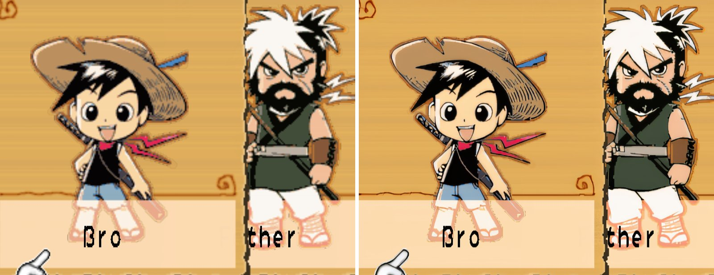

# River King: A Wonderful Journey (SLUS-21275) - disc HD texture pack recipe

**Status:** completed. NTSC-U disc (Natsume / Marvelous, 2006). The 4x pack is built and runs
on the Thor; it was checked in the opening scenes, not in the fishing or the rest of the game.

A 4x HD pack for River King: A Wonderful Journey, built from your own disc. No gameplay dumping:
every texture is read off the disc, upscaled with 4x-UltraSharp and matched exactly by the
emulator. How that works: [docs/hd-texture-packs.md](../../docs/hd-texture-packs.md).

## Before / after






Screenshots: `gsrunner` replays of GS dumps on the AYN Thor at 3x internal resolution, 1:1 crops,
original on the left.

## Make it

Requirements: [hd-packs/README.md](../README.md#making-a-pack-from-a-recipe). From the repository
root:

```bash
python tools/disc_textures/make_pack.py hd-packs/SLUS-21275-river-king \
    --disc "River King - A Wonderful Journey (USA).chd" --model 4x-UltraSharp.safetensors
```

Install: unzip `work/SLUS-21275-disc-hd4x.zip` into `<DataRoot>/textures/`.

### Measured on an RTX 3060 12 GB

A clean run from the `.chd` into a fresh work folder, 2026-09-23/24 (Core i7-11700, 32 GB RAM,
RTX 3060 12 GB, CUDA fp16, nothing else running):

| Step | Time | Output |
| --- | --- | --- |
| disc (chdman) | 34 s | `disc.iso`, 1.25 GB |
| extract | 22 s | `native/`: 8,034 PNGs, 117 MB (1,586 font glyphs), 125 M texels |
| upscale 4x | 33 min | `hd4x/`: 3.3 GB |
| build | 10 min | `pack_hd4x/replacements/`: 1.43 GB - 8,017 images (6,432 ASTC with zstd, 1,585 font index maps), a 169 MB index (rebuilt 2026-09-25: ASTC with repaired alpha blocks, zstd) |
| zip | 53 s | `SLUS-21275-disc-hd4x.zip`, 1.33 GB |
| **total** | **about 45 min** | |

Free disk for the work folder: about 8 GB, plus the disc image. The build step is the one with
the exact-alpha ASTC check (see below); the first build, before it, took 6 min and made a 1.5 GB
zip that speckled on the Thor.

## Coverage

`gsrunner` replays of desktop GS dumps on the Thor at 3x, 2026-09-23. The 1x pack (every disc
image at native size, `hw_mipmap=false`) against an empty pack proves the matches exact; the 4x
pack is the one you install:

| Scene | Textures matched | 1x vs empty pack | 4x pack |
| --- | --- | --- | --- |
| Title screen | 44 of 44 | bit-identical | 44 matched, no load errors |
| Character selection | 36 of 36 | bit-identical | 36 matched |
| Name entry | 37 of 37 | bit-identical | 37 matched |
| First dialogue | 36 of 36 | bit-identical | 36 matched |
| The house (3D, intro) | 30 of 30 | bit-identical | 30 matched |

In the app (the house save state, 3x, RAISR-HD on): 34 textures matched from boot to the house, 0
misses. The text is matched too: the game draws each line into a glyph cache, and the emulator
builds those caches out of the font's glyphs (the name-entry sheet is one texture of 86 glyphs).

## Not yet

- Only the opening is checked - no fishing, river, town or menu scenes yet.
- 831 textures have 16-bit palettes; the GS turns those into 32-bit ones with TEXA, which no
  checked scene showed, so the extractor guesses the usual values (see `extractor.py`). If those
  textures never match, that guess is why.
- Every image is ASTC (zstd-compressed). River King alpha-tests `EQUAL 0x80`, so alpha must come
  back exact; the blocks where ASTC misses it are re-encoded by hand (`astc.py`), including the
  ones that mix transparent, exactly opaque and above-0x80 texels (three alpha levels).

## How the disc stores its textures

Full details in [`extractor.py`](extractor.py)'s docstring. In short:

- Everything but the music is one CRI AFS archive, `DATA0000.AFS` (898 MB). Its entries are
  Nintendo U8 archives (models and their textures), texture lists (`.tex`, `.tpl`) and single
  textures - all uncompressed, except three `.arc.clz` archives.
- `.clz` is an LZSS whose references are distances back in the output, not window positions
  (`disc_codecs.clz_unpack`). A ring-buffer reading of the same bits decodes to the right size
  and garbage; stepping through the stream against the U8 header it has to produce settled it.
  The three hold the UI (`commonall`), the map window and sky (`preload`) and 125 character
  archives (`mainchapter0`).
- Every texture is a `P2IG` image: a 128-byte header (log2 size, PSM, CLUT format, offsets), the
  CLUT, then linear indices. 256-colour CLUTs are stored CSM1-swizzled, 16-colour ones not. A raw
  scan for `P2IG` finds every texture, wherever it sits.
- The dialogue font is not in the AFS: it is a 1-bit 24x24 table of 1,586 glyphs in the
  executable. The `.uf` fonts in the AFS (2-bit, antialiased) are another font the checked scenes
  do not use.
- The game alpha-tests almost every draw with `EQUAL 0x80`, so HD textures must keep alpha exact.
  ASTC did not: the first 4x pack speckled on the Thor (41% of an opaque texture's texels at
  0x7F/0x81, failing the test and skipping their depth write) while the 1x PNG proof was exact.
  `astc.py` now weights alpha heavily, verifies every image and keeps a PNG where ASTC cannot.
- A dead end worth knowing: `verify_dumps.py` first showed a third of the dumps as "palette only".
  They were full-size textures PCSX2 names by raw GS blocks, which a crop hash never reproduces;
  their colours were identical. The tool now falls back to comparing colours.

## Checksums

| | |
| --- | --- |
| Disc ISO SHA-1 (after `disc.py`) | `eb95fbc2654099fc66567fd0e57458c41681d374` |
| Upscale model SHA-256 (`4x-UltraSharp.safetensors`) | `36a340b5509b699d2c06cb445ddc1d3d39199ac734d889ed6d7915f60e05bcbc` |
| Index `disc-atlas.a2at` SHA-256 (ASTC + zstd pack) | `6a54d3519ae516bcaded9ecfd15264f8a2c7bf9d47ea448ef1d093fb6565b96a` |

## Playing with it

On the Thor (8 Gen 2) at 3x internal resolution with RAISR-HD on, the house with the pack runs at
59.5 fps with the EE at 25%, the GS thread at 5% and the GPU at 5% (the emulator's 30-second
PerfLog), so there is plenty of room for 2x fast-forward.
